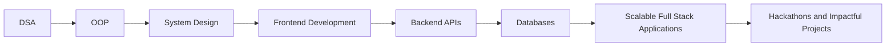

 

---

<h2 align="center">About Me</h2>

  Software Engineering student pursuing <b>B.Tech in Computer Science and Engineering</b> at
  <b>Madan Mohan Malaviya University of Technology, Gorakhpur</b>, with a <b>CGPA of 8.28/10</b>.
   
  Focused on <b>DSA, OOP, System Design, full stack development, backend engineering, and scalable applications</b>.

| Profile Snapshot | Details |
|---|---|
| Degree | B.Tech in CSE |
| Institute | MMMUT Gorakhpur |
| Graduation | 2027 |
| CGPA | 8.28/10 |
| Core Strengths | DSA, Java, Python, OOP, System Design |
| Development Stack | React.js, Node.js, Flask, PostgreSQL, REST APIs |

---

<h2 align="center">Education</h2>

| Qualification | Institute | Score | Duration |
|---|---|---:|---|
| B.Tech, Computer Science and Engineering | Madan Mohan Malaviya University of Technology, Gorakhpur | 8.28/10 | 2024–2027 |
| Diploma, Computer Science and Engineering | Government Polytechnic Premdhar Patti, Pratapgarh | 81.08% | 2021–2024 |

---

<h2 align="center">Tech Stack</h2>

  

---

<h2 align="center">Engineering Journey</h2>

---

<h2 align="center">Experience</h2>

  

 

- **Flux College Society Platform — Executive Member, Technology**  
  **Aug 2024 – Present | Gorakhpur**  
  Contributed to the development and maintenance of a production-grade event management platform serving **500 concurrent users**, using **React.js, Node.js, and MongoDB**.

---

<h2 align="center">Featured Projects</h2>

<table>
  <tr>
    <td width="33%">
      <h3 align="center">Flux</h3>
      
<b>React.js · Node.js · Express.js · MongoDB · JWT</b>

      

        Built a scalable event management platform handling <b>500 concurrent users</b> with real-time sync and JWT-based authentication.
      

    </td>
    <td width="33%">
      <h3 align="center">Nazar AI</h3>
      
<b>React.js · TypeScript · Node.js · Express.js · Gemini AI Vision · Twilio · JWT · RBAC</b>

      

        Architected an AI-powered app that reduced complaint resolution time by <b>40%</b> through automated routing.
      

    </td>
    <td width="33%">
      <h3 align="center">Exam Sparks</h3>
      
<b>React.js · Flask · PostgreSQL · SQLAlchemy</b>

      

        Developed production-grade REST APIs supporting <b>200 simultaneous users</b> with real-time grading and auto-evaluation logic.
      

    </td>
  </tr>
</table>

---

<h2 align="center">GitHub Analytics</h2>

  

---

<h2 align="center">Achievements</h2>

| Achievement | Details |
|---|---|
| India Innovates 2026 | Presented **Nazar AI** at **Bharat Mandapam, New Delhi**, selected among top national engineering teams |
| DecodexX National Hackathon | Ranked in the **Top 10 nationally** at **NLDIMSR Mumbai** |
| Udemy Python Certification 2025 | Completed coursework in **OOP, REST API development, backend frameworks, and scalable system architecture** |

---

<h2 align="center">Contribution Activity</h2>

---

<h2 align="center">Current Focus</h2>

---

