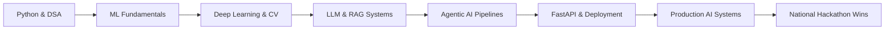

 

---

<h2 align="center">About Me</h2>

  AI/ML Engineer pursuing <b>B.Tech in Computer Science and Engineering</b> at
  <b>Madan Mohan Malaviya University of Technology, Gorakhpur</b>, with a <b>CGPA of 8.28/10</b>.
   
  I build AI systems that go beyond demos — <b>production LLM pipelines, agentic AI systems, RAG architectures,
  and computer vision apps</b> that handle real users. Ranked <b>#1 nationally out of 1,200+ teams</b> at India Innovates 2026.

| Profile Snapshot | Details |
|---|---|
| Degree | B.Tech in CSE |
| Institute | MMMUT Gorakhpur |
| Graduation | 2027 |
| CGPA | 8.28/10 |
| Core Strengths | LLM Systems · RAG · Agentic AI · Computer Vision · FastAPI |
| AI Stack | LangChain · Groq · ChromaDB · YOLOv8 · Sentence-Transformers · Streamlit |

---

<h2 align="center">Education</h2>

| Qualification | Institute | Score | Duration |
|---|---|---:|---|
| B.Tech, Computer Science and Engineering | Madan Mohan Malaviya University of Technology, Gorakhpur | 8.28/10 | 2024–2027 |
| Diploma, Computer Science and Engineering | Government Polytechnic Premdhar Patti, Pratapgarh | 81.08% | 2021–2024 |

---

<h2 align="center">Tech Stack</h2>

  

---

<h2 align="center">Engineering Journey</h2>

---

<h2 align="center">Experience</h2>

  

 

- **Flux College Society Platform — Executive Member, Technology**  
  **Jul 2025 – Present | Gorakhpur**  
  Led development and maintenance of a production-grade event management platform serving **500+ active users**, built on **React.js, Node.js, and MongoDB**. Managed end-to-end product lifecycle — feature planning, sprint execution, and live deployment.

---

<h2 align="center">Featured Projects</h2>

<table>
  <tr>
    <td width="33%">
      <h3 align="center">NazarAI</h3>
      
<b>YOLOv8m · Gemini 1.5 Flash · FastAPI · React · TypeScript</b>

      

        Civic-tech AI platform for real-time pothole and garbage detection.
        <b>71.8% mAP50</b> across 6 issue categories. Built in <b>4 days by a team of 4</b>.
        Ranked <b>#1 nationally at India Innovates 2026</b> (1,200+ teams) and
        <b>Top 10 Finalist at DecodexX, NLDIMSR Mumbai</b> (250 teams).
        Pitched live to the Amethi District Collector.
      

    </td>
    <td width="33%">
      <h3 align="center">Auto Data Analyst</h3>
      
<b>LangGraph · LLaMA 3.3 70B · Groq · Streamlit · FastAPI</b>

      

        Multi-agent LangGraph pipeline that accepts CSV uploads and auto-generates
        statistical summaries, correlation heatmaps, and <b>AI-written natural language insights</b>
        — no code needed. Live in production on Render.
      

    </td>
    <td width="33%">
      <h3 align="center">Chat with Database</h3>
      
<b>LangChain · Groq · FastAPI · React · SQL · MongoDB</b>

      

        Natural language → SQL/MongoDB query engine via LLM. Ask questions in plain English,
        get structured answers. Handles <b>SELECT, JOINs, aggregations, and GROUP BY</b>
        — no SQL knowledge required.
      

    </td>
  </tr>
</table>

---

<h2 align="center">GitHub Analytics</h2>

  

---

<h2 align="center">Achievements</h2>

| Achievement | Details |
|---|---|
| 🥇 India Innovates 2026 — **#1 Nationally** | Presented **NazarAI** at **Bharat Mandapam, New Delhi** — ranked **Top out of 1,200+ teams** nationwide |
| 🏆 DecodexX National Hackathon — **Top 10 Finalist** | Ranked **Top 10 out of 250 teams** at **NLDIMSR Mumbai** with NazarAI |
| 💻 LeetCode — **300+ Problems Solved** | 127 Easy · 150 Medium · 15 Hard · Peak Contest Rating **1512** |
| 📜 Cisco Data Science Certification | End-to-end data science methodology, ML fundamentals, and applied analytics |
| 🛰️ ISRO-IIRS Certificate of Merit | Remote sensing and geospatial AI applications |

---

<h2 align="center">Contribution Activity</h2>

---

<h2 align="center">Current Focus</h2>

---

